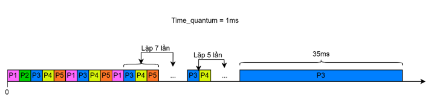

# MULTITASKING SCHEDULER

### RMS (RATE MONOTONIC SCHEDULING)

> - à một thuật toán lập lịch thời gian thực, sử dụng ưu tiên tĩnh (static priority), trong đó các nhiệm vụ (task) được ưu tiên dựa trên chu kỳ (period) của chúng. RMS thường được sử dụng trong các hệ thống thời gian thực cứng (hard real-time systems) để đảm bảo các nhiệm vụ đáp ứng đúng hạn (deadline).

- Các task sử dụng để lập lịch RMS:

- Từ bảng trên, ta có đánh giá sau: Task 1, Task 2 và Task 5 có chu kỳ ngắn nhất, cho nên các task này sẽ có mức ưu tiên cao nhất. Lần lượt đặt mức ưu tiên cho Task 1, Task 2 và Task 5 từ cao xuống thấp. Tiếp đó đến Task 4 có mức ưu tiên cao thứ tư, và Task 3 do có chu kỳ lớn nhất nên sẽ có mức ưu tiên thấp nhất.

- Giới hạn trên nhỏ nhất được tính toán dựa trên chu kỳ/tốc độ thực hiện cho tất cả các quy trình nhất định và cộng tất cả lại với nhau để có được giá trị sử dụng.

- Dưới đây là hình ảnh bộ lập lịch RMS của dự án

### ROUND ROBIN

> - Trong freeRTOS, khi các task có mức ưu tiên giống nhau, thì chương trình sẽ chạy theo bộ lập lịch Round Robin, với time_quantum = 1/TickRateHZ
> - Round Robin là một phương pháp lập lịch vòng tròn, tức là hệ thống sẽ tiến hành thực thi một cách xoay vòng qua tất cả các tiến trình, phân bổ cho các tiến trình một khoảng thời gian thực cố định để thực thi cho đến khi có tiến trình khác được thực hiện, khoảng thời gian này được gọi là “time - quantum”. Các task được thực hiện một cách xoay vòng tuần tự, bất kể mức độ ưu tiên của chúng.

- Dưới đây là hình ảnh về bộ lập lịch Round Robin của dự án:

