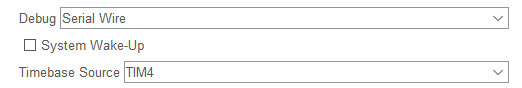
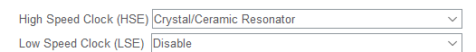
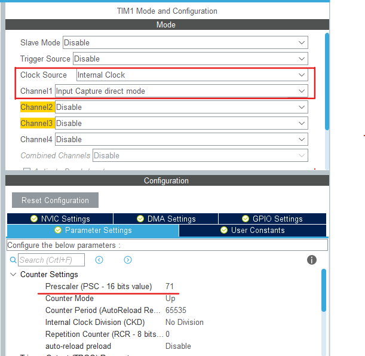
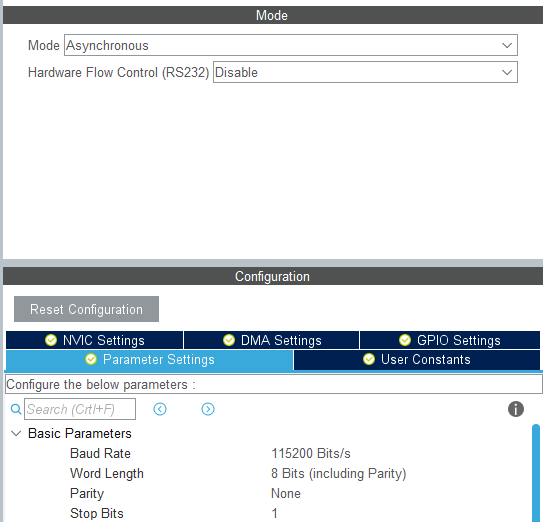
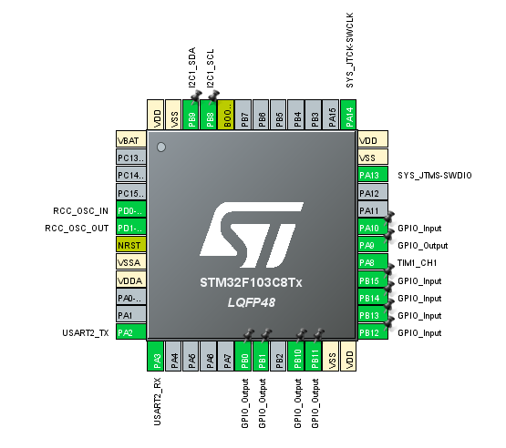

# BÀI TẬP LỚN MÔN HỌC EMBEDDED SYSTEM - NHÓM 23

### Thành viên:

> - Lê Đình Sơn - MSSV: 20212950
> - Hà Lê Trọng Nghĩa - MSSV: 20212905
> - Hoàng Ngọc Khải - MSSV: 20210460

### Về Repo này:

> - Trong Repo sẽ chia ra làm 5 folder, trong đó có 1 folder chứa các thư viện của các ngoại vi, mọi người ai có thư viện gì thì tống hết vào đấy
> - 4 Folder còn lại là các folder riêng cho từng bộ lập lịch
> - Mọi người ai làm bộ lập lịch nào, thì đẩy vào thư mục chứa bộ lập lịch đó nhé

### Các bộ lập lịch lựa chọn:

Đơn nhiệm:

> - Bộ lập lịch theo thời gian
> - Bộ lập lịch theo sự kiện

Đa nhiệm:

> - RMS
> - Round_robin

=> Thông tin lý thuyết sẽ được lưu trong từng Folder

### Cấu hình cho phần cứng:

- Chế độ debug: Serial Wire, Timebase sử dụng là TIM4 vì SysTick được sử dụng cho freeRTOS

- Chọn clock: HSE ==> Crystal/Ceramic Resonator

- Các chân GPIO:

PB0, PB1, PB10, PB11 (Output) ==> Nối với các chân Input của Keypad

PB12, PB13, PB14, PB15 (Input pull up) ==> Nối với các chân Output của Keypad

PA9 (Output) ==> Chân Trigger của HCSR04

PA10 (Input) ==> Chân OUT của Sound Sensor

PA8 (Timmer 1 - Input capture direct mode) ==> Chân echo của HCSR04

- Cấu hình TIM1 như hình bên dưới: => Timer dùng cho việc đếm thời gian từ lúc sóng siêu âm phát ra đến khi nhận lại của HCSR04, từ đó tính ra khoảng cách

- Cấu hình I2C1 ==> Dùng cho LCD 16x2 I2C

- Cấu hình UART2 ==> Dùng cho việc truyền UART kết nối với máy tính, phần cứng sử dụng là USB to TTL CP2102

- Chọn freeRTOS CMSIS_V1, tạo các task và các queue và code

- Hình ảnh về cấu hình STM32 như sau:

